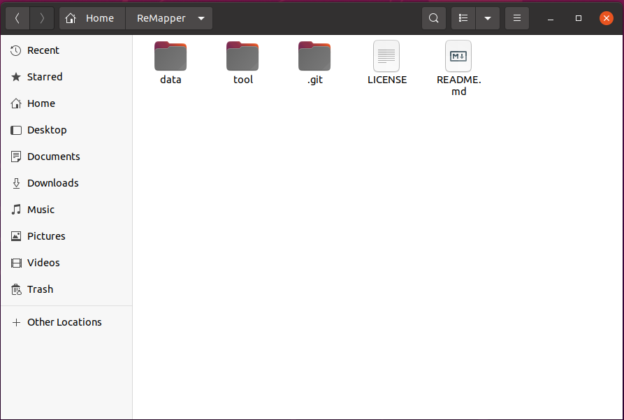
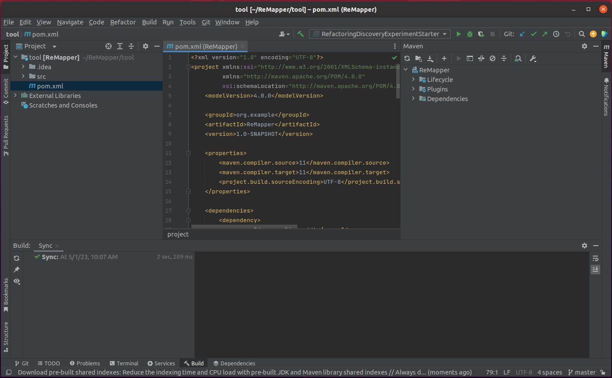
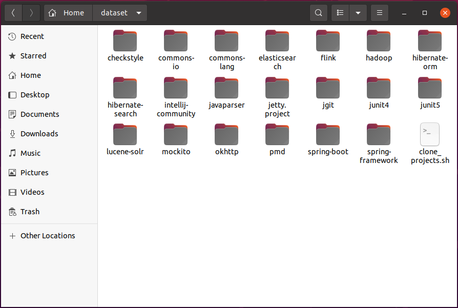
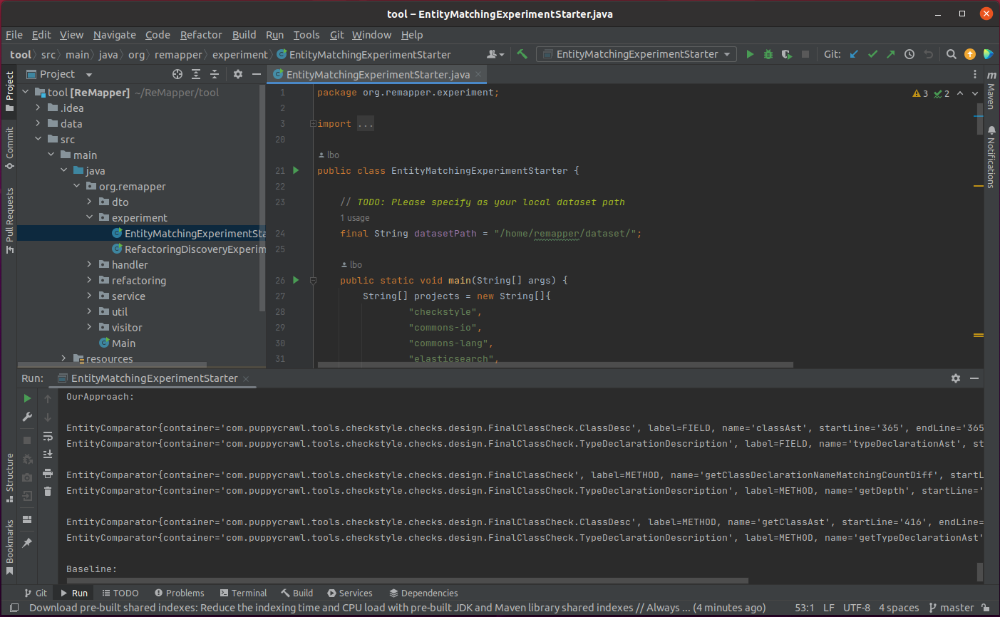
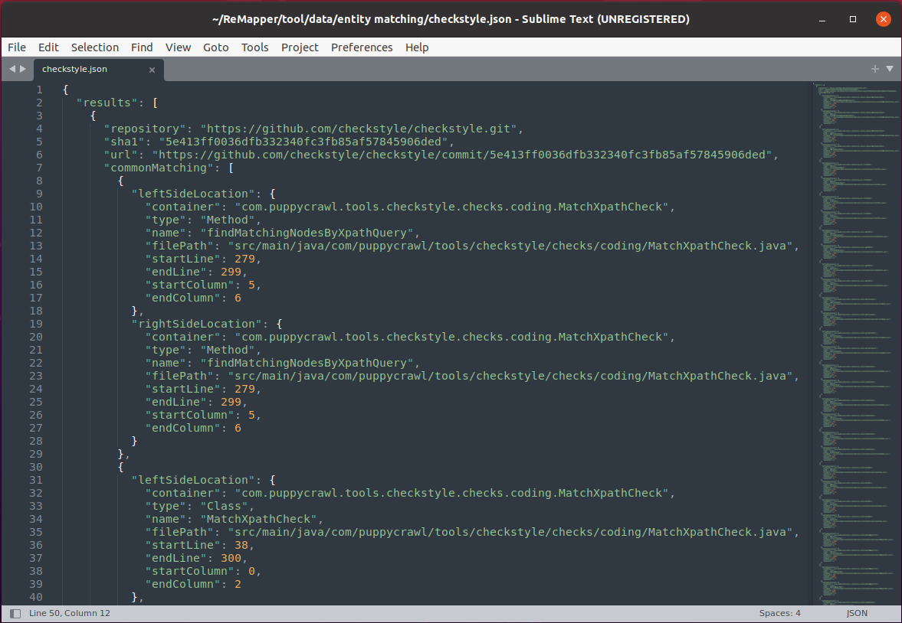
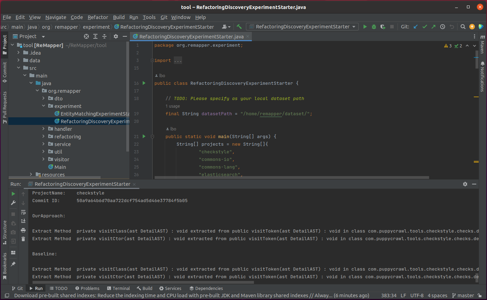
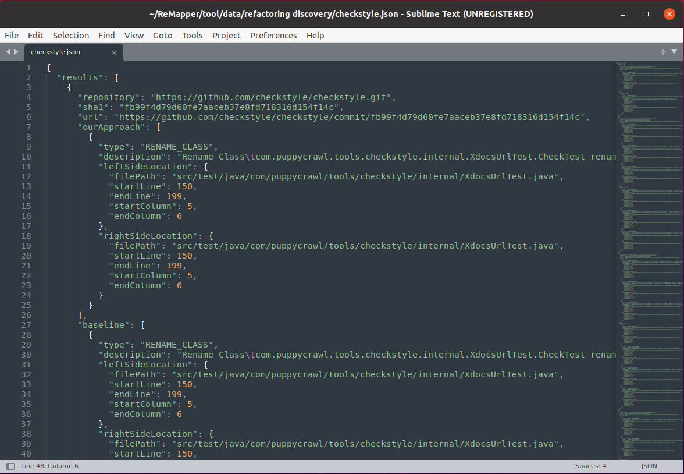

# Table of Contents

- [General Introduction](#general-introduction)
- [Contents of the Replication Package](#contents-of-the-replication-package)
- [Requirements](#requirements)
- [Data](#data)
- [How to Replicate the Evaluation](#how-to-replicate-the-evaluation)
- [Comparison against JDiff](#comparison-against-jdiff)

# General Introduction

This is the replication package for ASE2023 submission, containing both tool and data that are requested by the replication. It also provides detailed instructions to replicate the evaluation.

# Contents of the Replication Package

/data: Input of the evaluation as well as the outputs of the evaluation.

/tool: The implementation of the evaluated approaches (including the proposed approach and the baseline approach).

# Requirements

- Java 11.0.17 or newer
- Apache Maven 3.6.3 or newer

# Data

### 1. Scripts

Two scripts (**clone_projects.bat** and **clone_projects.sh**) that can downlow dataset from open-source projects, and the resulting dataset should be taken as the input of the evaluation.

### 2. Entity Matching

All results reported by the proposed approach and the baseline approach as well as the labels manually validated by the experienced developers, are available at the following links:

* [entity matching](data/entity%20matching/)

Each JSON file represents the results of running entity matching experiments of the proposed approach and the baseline approach separately in a project.

#### &emsp;&emsp;JSON descriptions

&emsp;&emsp;**repository**: Git repository name  
&emsp;&emsp;**sha1**: Git commit ID  
&emsp;&emsp;**url**: patch corresponding to the commit  
&emsp;&emsp;**commonMatching**: common matched entity pairs reported by the evaluated approaches  
&emsp;&emsp;**ourApproach**: inconsistent entity pairs reported by the proposed approach against the baseline approach  
&emsp;&emsp;**baseline**: inconsistent entity pairs reported by the baseline approach against the proposed approach  
&emsp;&emsp;**leftSideLocation**: position of the entity in the old version  
&emsp;&emsp;**rightSideLocation**: position of the entity in the new version  
&emsp;&emsp;**container**: container in which entity belongs to  
&emsp;&emsp;**type**: type of entity  
&emsp;&emsp;**name**: name of entity  
&emsp;&emsp;**filePath**: file path in which the entity is declared  
&emsp;&emsp;**startLine**: start line of entity declaration  
&emsp;&emsp;**endLine**: end line of entity declaration  
&emsp;&emsp;**startColumn**: start column of entity declaration  
&emsp;&emsp;**endColumn**: end column of entity declaration  
&emsp;&emsp;**developerConfirmation**: label manually validated by the developers

### 3. Refactoring Discovery

All results reported by the proposed approach and the baseline approach as well as the labels manually validated by the refactoring experts, are available at the following links:

* [refactoring discovery](data/refactoring%20discovery/)

Each JSON file represents the results of running refactoring discovery experiments of the proposed approach and the baseline approach separately in a project.

#### &emsp;&emsp;JSON descriptions

&emsp;&emsp;**repository**: Git repository name  
&emsp;&emsp;**sha1**: Git commit ID    
&emsp;&emsp;**url**: patch corresponding to the commit    
&emsp;&emsp;**ourApproach**: refactoring operations reported by the proposed approach    
&emsp;&emsp;**baseline**: refactoring operations reported by the baseline approach    
&emsp;&emsp;**type**: type of refactoring    
&emsp;&emsp;**description**: description of refactoring    
&emsp;&emsp;**leftSideLocation**: position of the entity in the old version    
&emsp;&emsp;**rightSideLocation**: position of the entity in the new version    
&emsp;&emsp;**filePath**: file path in which the entity is declared    
&emsp;&emsp;**startLine**: start line of entity declaration    
&emsp;&emsp;**endLine**: end line of entity declaration    
&emsp;&emsp;**startColumn**: start column of entity declaration    
&emsp;&emsp;**endColumn**: end column of entity declaration    
&emsp;&emsp;**developerConfirmation**: label manually validated by the experts

# How to Replicate the Evaluation?

## IntelliJ IDEA

1. **Clone replicate package to your local file system**

   `git clone https://github.com/lyoubo/ReMapper.git`

   

2. **Import project**

   Go to *File* -> *Open...*

   Browse to the **tool** directory of project ReMapper

   Click *OK*

   The project will be built automatically.

   

3. **Clone open-source project repositories (dataset)**

   `double-click clone_projects.bat` &emsp;&nbsp;(on windows environment)

   `./clone_projects.sh` &emsp;&emsp;&emsp;&emsp;&emsp;&emsp;&emsp;(on linux environment)

   

4. **Run the entity matching experiment**

   Set `datasetPath` to the directory where the cloned dataset is located (line 24 in org.remapper.experiment.EntityMatchingExperimentStarter.java)

   From the Project tab of IDEA navigate to `org.remapper.experiment.EntityMatchingExperimentStarter`

   Right-click on the file and select *Run EntityMatchingExperimentStarter.main()*

   All results of entity matching will be output to the console

   

   All results of entity matching will be stored in the local file system in JSON format:

   `/data/entity matching/<project>.json` 

   

5. **Run the refactoring discovery experiment**

   Set `datasetPath` to the directory where the cloned dataset is located (line 19 in org.remapper.experiment.RefactoringDiscoveryExperimentStarter.java)

   From the Project tab of IDEA navigate to `org.remapper.experiment.RefactoringDiscoveryExperimentStarter`

   Right-click on the file and select *Run RefactoringDiscoveryExperimentStarter.main()*

   All results of refactoring discovery will be output to the console

   

   All results of refactoring discovery will be stored in the local file system in JSON format:

   `/data/refactoring discovery/<project>.json` 

   

# Comparison against JDiff

As an online appendix, we present here the comparison between ReMapper (the proposed approach) and JDiff (the latest pure entity matching algorithm). Notably, the setting of the comparison is exactly the same as what is specified in Section III-A of the paper. Because JDiff currently matches only classes, interfaces, and methods whereas ReMapper supports much more entity types, in this evaluation, we only considered the entity types supported by both of them (i.e., classes, interfaces, and methods).

Our evaluation results are presented in Fig. 1. The horizontal axis presents the involved projects where the last one (“refactoring-engine”) is the closed-source project whereas others are open-source projects. The vertical axis presents the number of false positives and false negatives as well their sum (i.e., #FP, #FN, and #MST) on each subject project.

<b>Fig. 1.</b> Number of Mistakes per Project

From Fig. 1, we observe that compared against the pure entity matching algorithm JDiff, ReMapper substantially reduced the frequency of mistakes: The total number of mistakes (i.e., #MST) was reduced from 738 to 48, with a substantial reduction of 93.5%=(738-48)/738. On average, the number of false positives per project was reduced by 62.9%=(3.5-1.3)/3.5 and the number of false negatives per project was reduced by 96.8%=(31.7-1)/31.7. We performed a significance test to validate whether there is a statistically significant difference between the total number of mistakes caused by the two approaches. Our evaluation results (*p*-value=2.17E-5 and effect size of Cohen's *d*=1.52) confirmed that the reduction in #MST was statistically significant. 

We further investigated their performance on matching different categories of software entities, i.e., "classes", "interfaces", and "methods". The evaluation results are presented in Table 1. We observe from Table 1 that ReMapper outperforms JDiff on all of the involved entity types.

<b>Table 1</b> Performance per Entity Type

<table>
	<tr>
	    <td>Entity Type</td>
	    <td>Approaches</td>
	    <td align="right">#MST</td>
        <td align="right">#FP</td>
        <td align="right">#FN</td>
        <td align="right">#Precision</td>
        <td align="right">#Recall</td>
	</tr>
	<tr>
	    <td rowspan="3">Class</td>
	    <td>ReMapper</td>
	    <td align="right">0</td>
        <td align="right">0</td>
        <td align="right">0</td>
        <td align="right">100%</td>
        <td align="right">100%</td>
	</tr>
	<tr>
	    <td>JDiff</td>
	    <td align="right">77</td>
        <td align="right">0</td>
        <td align="right">77</td>
        <td align="right">100%</td>
        <td align="right">94.95%</td>
	</tr>
	<tr>
	    <td>^ Improvement</td>
	    <td align="right">77</td>
        <td align="right">0</td>
        <td align="right">77</td>
        <td align="right">0</td>
        <td align="right">5.05%</td>
	</tr>
	<tr>
	    <td rowspan="3">Interface</td>
        <td>ReMapper</td>
	    <td align="right">0</td>
	    <td align="right">0</td>
        <td align="right">0</td>
        <td align="right">100%</td>
        <td align="right">100%</td>
	</tr>
	<tr>
	    <td>JDiff</td>
	    <td align="right">8</td>
        <td align="right">0</td>
        <td align="right">8</td>
        <td align="right">100%</td>
        <td align="right">92.08%</td>
	</tr>
	<tr>
	    <td>^ Improvement</td>
	    <td align="right">8</td>
        <td align="right">0</td>
        <td align="right">8</td>
        <td align="right">0</td>
        <td align="right">7.92%</td>
	</tr>
    <tr>
	    <td rowspan="3">Method</td>
	    <td>ReMapper</td>
	    <td align="right">48</td>
        <td align="right">27</td>
        <td align="right">21</td>
        <td align="right">99.21%</td>
        <td align="right">99.38%</td>
	</tr>
	<tr>
	    <td>JDiff</td>
	    <td align="right">653</td>
        <td align="right">73</td>
        <td align="right">580</td>
        <td align="right">97.47%</td>
        <td align="right">82.92%</td>
	</tr>
	<tr>
	    <td>^ Improvement</td>
	    <td align="right">605</td>
        <td align="right">46</td>
        <td align="right">559</td>
        <td align="right">1.74%</td>
        <td align="right">16.46%</td>
	</tr>
</table>

