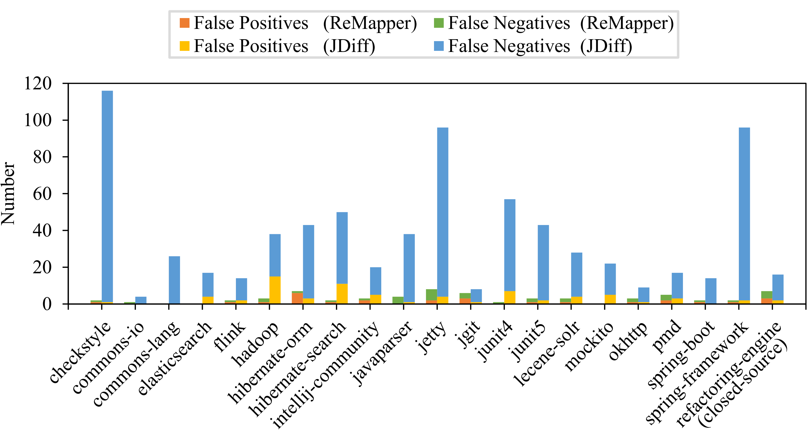

# Comparing ReMapper against JDiff

As an online appendix, we present here the comparison between ReMapper (the proposed approach) and JDiff (the latest pure entity matching algorithm). Notably, the setting of the comparison is exactly the same as what is specified in Section III-A of the paper. Because JDiff currently matches only classes, interfaces, and methods whereas ReMapper supports much more entity types, in this evaluation, we only considered the entity types supported by both of them (i.e., classes, interfaces, and methods).

Our evaluation results are presented in Fig. 1. The horizontal axis presents the involved projects where the last one (“refactoring-engine”) is the closed-source project whereas others are open-source projects. The vertical axis presents the number of false positives and false negatives as well their sum (i.e., #FP, #FN, and #MST) on each subject project.

<b>Fig. 1.</b> Number of Mistakes per Project

From Fig. 1, we observe that compared against the pure entity matching algorithm JDiff, ReMapper substantially reduced the frequency of mistakes: The total number of mistakes (i.e., #MST) was reduced from 738 to 48, with a substantial reduction of 93.5%=(738-48)/738. On average, the number of false positives per project was reduced by 62.9%=(3.5-1.3)/3.5 and the number of false negatives per project was reduced by 96.8%=(31.7-1)/31.7. We performed a significance test to validate whether there is a statistically significant difference between the total number of mistakes caused by the two approaches. Our evaluation results (*p*-value=2.17E-5 and effect size of Cohen's *d*=1.52) confirmed that the reduction in #MST was statistically significant. 

We further investigated their performance on matching different categories of software entities, i.e., "classes", "interfaces", and "methods". The evaluation results are presented in Table 1. We observe from Table 1 that ReMapper outperforms JDiff on all of the involved entity types.

<b>Table 1</b> Performance per Entity Type

<table>
	<tr>
	    <td>Entity Type</td>
	    <td>Approaches</td>
	    <td align="right">#MST</td>
        <td align="right">#FP</td>
        <td align="right">#FN</td>
        <td align="right">#Precision</td>
        <td align="right">#Recall</td>
	</tr>
	<tr>
	    <td rowspan="3">Class</td>
	    <td>ReMapper</td>
	    <td align="right">0</td>
        <td align="right">0</td>
        <td align="right">0</td>
        <td align="right">100%</td>
        <td align="right">100%</td>
	</tr>
	<tr>
	    <td>JDiff</td>
	    <td align="right">77</td>
        <td align="right">0</td>
        <td align="right">77</td>
        <td align="right">100%</td>
        <td align="right">94.95%</td>
	</tr>
	<tr>
	    <td>^ Improvement</td>
	    <td align="right">77</td>
        <td align="right">0</td>
        <td align="right">77</td>
        <td align="right">0</td>
        <td align="right">5.05%</td>
	</tr>
	<tr>
	    <td rowspan="3">Interface</td>
        <td>ReMapper</td>
	    <td align="right">0</td>
	    <td align="right">0</td>
        <td align="right">0</td>
        <td align="right">100%</td>
        <td align="right">100%</td>
	</tr>
	<tr>
	    <td>JDiff</td>
	    <td align="right">8</td>
        <td align="right">0</td>
        <td align="right">8</td>
        <td align="right">100%</td>
        <td align="right">92.08%</td>
	</tr>
	<tr>
	    <td>^ Improvement</td>
	    <td align="right">8</td>
        <td align="right">0</td>
        <td align="right">8</td>
        <td align="right">0</td>
        <td align="right">7.92%</td>
	</tr>
    <tr>
	    <td rowspan="3">Method</td>
	    <td>ReMapper</td>
	    <td align="right">48</td>
        <td align="right">27</td>
        <td align="right">21</td>
        <td align="right">99.21%</td>
        <td align="right">99.38%</td>
	</tr>
	<tr>
	    <td>JDiff</td>
	    <td align="right">653</td>
        <td align="right">73</td>
        <td align="right">580</td>
        <td align="right">97.47%</td>
        <td align="right">82.92%</td>
	</tr>
	<tr>
	    <td>^ Improvement</td>
	    <td align="right">605</td>
        <td align="right">46</td>
        <td align="right">559</td>
        <td align="right">1.74%</td>
        <td align="right">16.46%</td>
	</tr>
</table>

